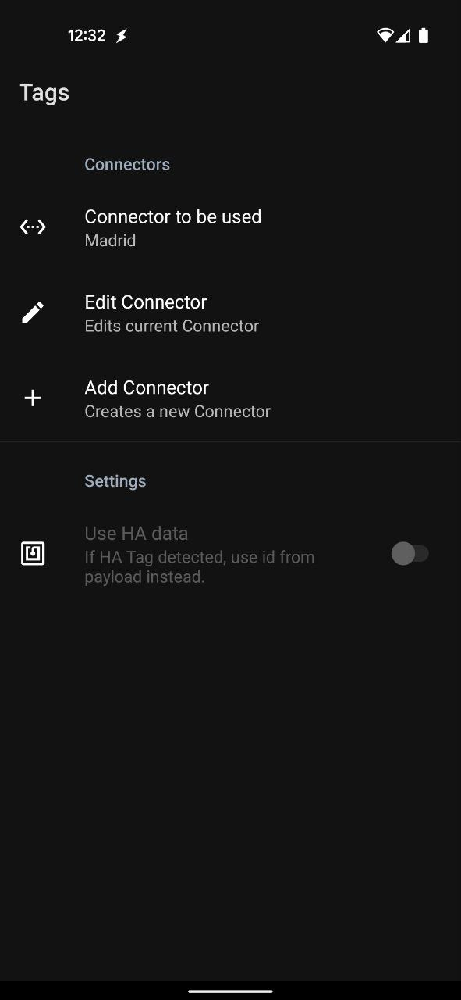
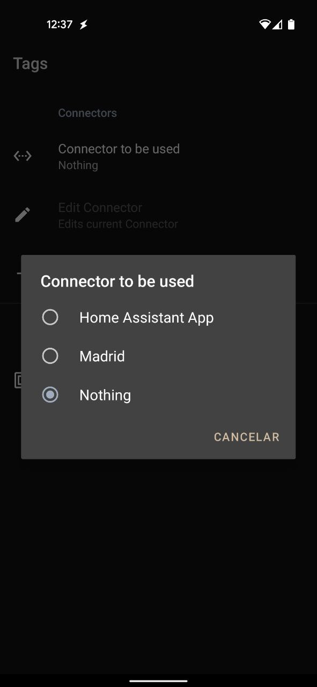
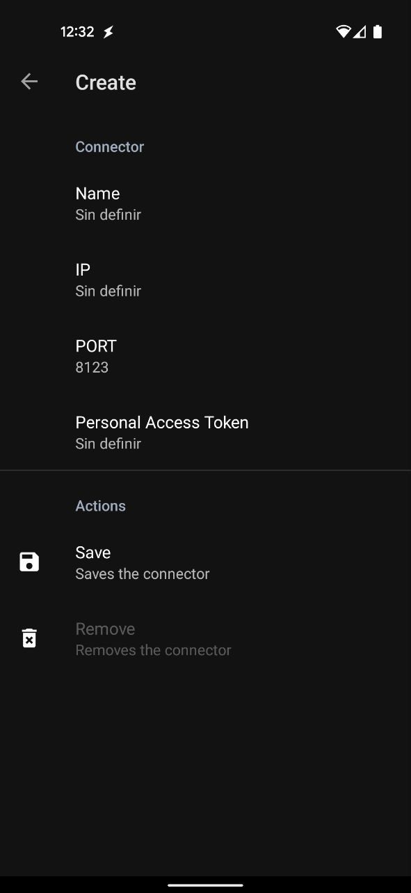
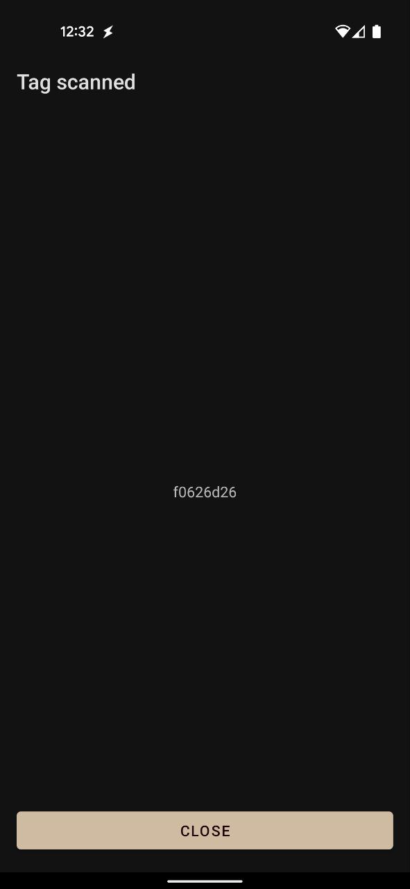

# Tags
Simple proxy app to trigger Home Assistant tag by reusing nfc cards/tags (i.e. Metro card).

## Usage
Any NFC card/tag read without any android-compatible payload, will be read, and the app will send a signal with the card ID to Home Assistant, via Intent or via API.

On the main Screen select, create or edit a connector, and thats it. If the app detects any [Home Assitant Companion App](https://companion.home-assistant.io) it automagically will show as a posible connector.

Use the "Nothing" connector to see the card's id to create the counterpart in Home Assitant acordingly. As the name suggest, it will trigger nothing.

> Any Home Assitant App connector will use the Intent method, any other Connector will trigger the Home Assitant api and thus will require a Personal Access Token ([Long-lived access token](https://developers.home-assistant.io/docs/auth_api/#long-lived-access-token))

## Download
Head to [releases](https://github.com/hkfuertes/nfc_ha_tags/releases) to grab the latest APK.

## Pro Tip
Use this app with Magisk module [NfcScreenOff](https://github.com/Magisk-Modules-Repo/NFCScreenOff) to convert an spare Nfc enabled phone into an RFID reader for Home Assitant.

## Screenshots

## TODO:
- Tweak "Tag Scanned" Screen
- If card has HA payload, use the that id instead
- Test read wifi network and list available networks.
  - **Optional**: If set, we can do any of the actions based on the location (via wifi availability/connection)
